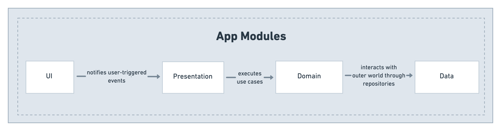
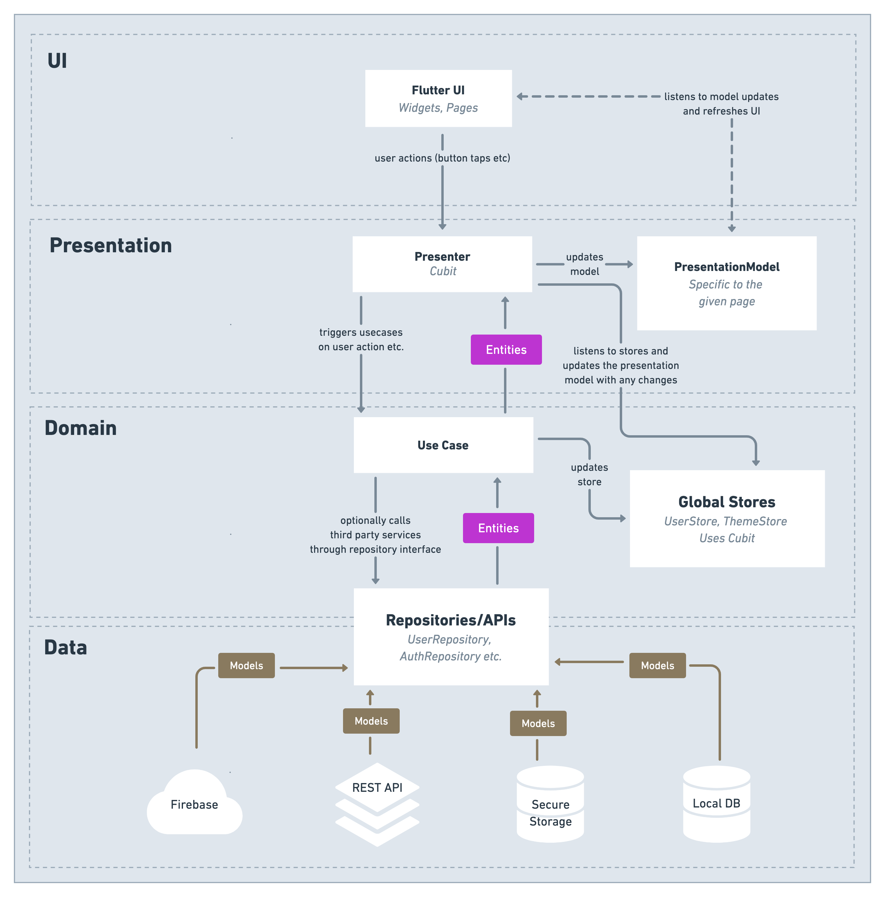
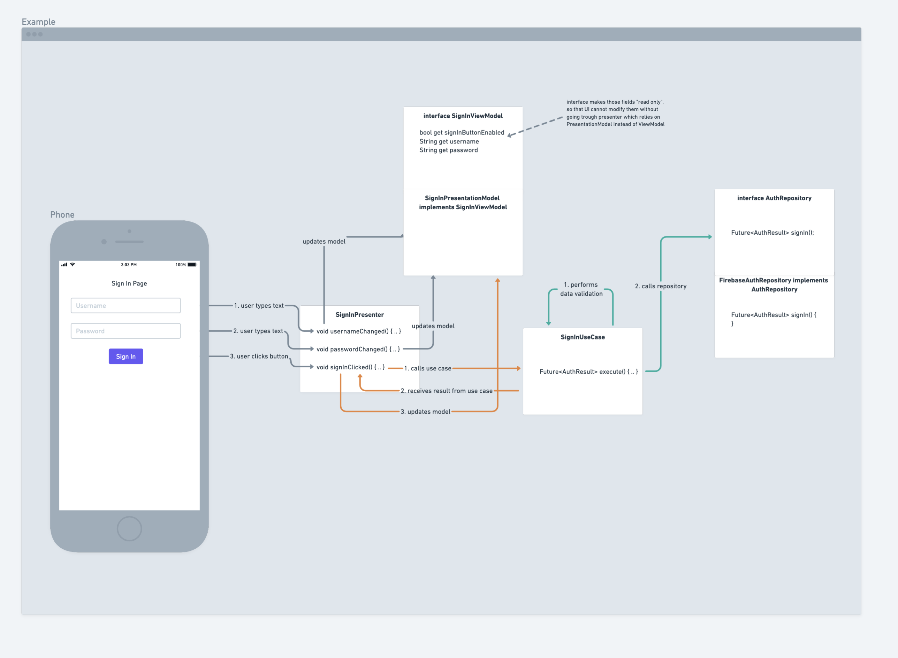

<!-- markdownlint-disable-file line-length -->
<!-- markdownlint-disable-file no-inline-html -->
<!-- markdownlint-disable-file ul-indent -->
<!-- markdownlint-configure-file
{
  "no-duplicate-heading": {
    "siblings_only": true
  },
  "no-trailing-spaces": false
}
-->

<a href="https://deeplink.getpicnic.app/">
<p align="center">
<picture>
  <source media="(prefers-color-scheme: dark)" srcset="https://i.imgur.com/2uiuE6M.png">
  
</picture></p></a> 


<p align="center">
<a href="https://play.google.com/store/apps/details?id=com.ambertech.amber">
</a>
<a href="https://apps.apple.com/es/app/picnic-dive-into-communities/id1544626265">
</a></p>

<p align="center">
  <a href="https://tiktok.com/@picnic_app" target="_blank"></a>
<a href="https://twitter.com/thepicnicapp" target="_blank"></a>
<a href="https://www.instagram.com/getpicnicapp" target="_blank"></a>
<a href="https://discord.gg/Ms4uPMyX" target="_blank"></a>
<a href="https://www.linkedin.com/company/get-picnic" target="_blank"></a>
  <br/>
  <a title="Downloads" alt="App Downloads" href="https://play.google.com/store/apps/details?id=com.ambertech.amber" target="_blank">
    
  </a>
    <a title="Ratings" alt="App Ratings" href="https://play.google.com/store/apps/details?id=com.ambertech.amber" target="_blank">
    
  </a>
  <br/>
    <a href="https://deeplink.getpicnic.app/">
    </a>
  <a title="Visits" href="https://deeplink.getpicnic.app/">
    </a>
  <br/>
  <a href="https://www.discord.gg/Ms4uPMyX">
    </a><br>
</p>

[Picnic](https://discord.gg/shiba) is a open source social media project meant to become the future of online communities.

<!-- TOC -->

- [Picnic Greenfield](#picnic-greenfield)
    - [Setup](#setup)
    - [Architecture](#architecture)
        - [UI](#ui)
        - [Presentation](#presentation)
        - [Domain](#domain)
        - [Data](#data)
        - [Navigation](#navigation)
            - [Navigator](#navigator)
            - [Route](#route)
            - [AppNavigator class](#appnavigator-class)
        - [Example](#example)
    - [Tools](#tools)
        - [FVM](#fvm)
        - [Code templates](#code-templates)
            - [Make commands](#make-commands)
            - [Mason commands](#mason-commands)
        - [Custom lints](#custom-lints)
        - [Fluttergen](#fluttergen)
        - [Dart code metrics](#dart-code-metrics)
        - [Fastlane](#fastlane)
        - [Flutter Launcher Icons](#flutter-launcher-icons)
            - [Update launcher icon](#update-launcher-icon)
            - [Attributes](#attributes)
        - [Widgetbook](#widgetbook)
            - [About](#about)
            - [Setup](#setup)
            - [Widgetbook app structure](#widgetbook-app-structure)
            - [Properties](#properties)
            - [Knobs](#knobs)
            - [New use case](#new-use-case)
            - [Run](#run)
        - [Localization](#localization)
    - [Code best practices & guidelines](#code-best-practices--guidelines)
        - [Pull Requests checklist](#pull-requests-checklist)
        - [General](#general)
        - [UseCase](#usecase)
        - [Repository](#repository)
        - [Failures](#failures)
            - [Example](#example)
        - [Domain entity](#domain-entity)
            - [Example](#example)
        - [Presenter](#presenter)
        - [ViewModel](#viewmodel)
        - [PresentationModel](#presentationmodel)
        - [Page](#page)
        - [Json classes](#json-classes)
            - [Example](#example)
    - [Collaborating guidelines](#collaborating-guidelines)
        - [Pull requests](#pull-requests)
        - [New libraries](#new-libraries)

<!-- TOC -->

## Setup

1. Install [flutter_gen](https://pub.dev/packages/flutter_gen) in your system and run:

   ```bash  
   fluttergen -c pubspec.yaml
   ```  

2. Ask your leader to give you acccess to `config.zip` file containing config specific to the app, that cannot be
   source-controlled. put the `config.zip` file in the root folder of the project and run:

    ```bash
    make extract_config
    ```

3. Install git hooks (optional)

   ```bash  
   ./scripts/install-git-hooks.sh  
   ```

4. Run

   ```bash  
   make check  
   ```  

This command comes useful when you want to make sure your code is clean and ready to be code-reviewed. it does the
following:

- runs [flutter_gen](https://pub.dev/packages/flutter_gen)
- formats your code
- runs `flutter analyze`
- runs unit tests and recreates all golden test screenshot files
- runs [dart_code_metrics](https://pub.dev/packages/dart_code_metrics) checks

## Architecture

The app follows clean architecture principles and is divided into 4 modules:



### UI

The UI Module contains Flutter widgets, animations, routes, pages and all the code that is responsible for the
appearance of the Picnic app. Furthermore, it is important to note that the module omits logic.

### Presentation

Home for `Presenter` and `PresentationModel` classes.

Presenters decide **WHEN** to display things. They trigger business logic from the `domain` module as well as update
the `PresentationModel` with relevant data, that is then used by the UI.

Moreover, the `PresentationModel` stores data, and exposes it to the UI through the `ViewModel` interface. This ensures
that the data is accessible to the UI in a _read-only_ manner, and all internals relevant to presentation is not
visible.

### Domain

`UseCase`, `Repository` and `Entity` classes.

This module contains the business logic of the application. It decides **WHAT** should be done in the event of user
interaction. The logic is encapsulated into the `UseCase` classes that communicate with the outer world through
repositories.

Repository interfaces are specified inside the `domain` module and are implemented by the `data` module. All the data
that `domain` operates on is encapsulated into domain entity classes.

### Data

The Data module takes care of communicating with the “outer world” and interacts with third party libraries. Here we
specify the REST API’s interactions, database access, _SharedPrefs_ or external sensor access. All the data is then
translated to domain entities that are agnostic of the libraries and technologies used in order to access them.

### Navigation

Navigation within the app uses the concept of mixin Routes and per-page Navigators.

#### Navigator

Navigator is a class that consist of 0 or more `Route`s mixins, its only job is to open another page. let's see it on an
example:

Assume we have a navigator for the `LoginPage` called `LoginNavigator`:

```dart
class LoginNavigator with NoRoutes {
  AppInitNavigator(this.appNavigator);

  @override
  final AppNavigator appNavigator;
}
```

by default, its mixed in with `NoRoutes` mixin that is a placeholder to be replaced with other routes. This navigator is
used
by `LoginPresenter` to open other pages, lets add possibility to Navigate to `DashboardPage` from
within `LoginNavigator`. We can do it
in the following way:

```dart
class LoginNavigator with DashboardRoute {
  // ...
}
```

as you can see, we mixed in the `DashboardRoute`

#### Route

Below you can see an implementation of the route

```dart
mixin DashboardRoute {
  Future<void> openDashboard(DashboardInitialParams initialParams) async {
    return appNavigator.push(
      OnboardingPageTransition(
        getIt<DashboardPage>(param1: initialParams),
      ),
    );
  }

  AppNavigator get appNavigator;
}
```

it specifies the the `openDashboard` method that now can be used on the `LoginNavigator` in order to open DashboardPage.
It uses
`appNavigator` under the hood that is a wrapper around Flutter navigation that streamlines navigation, more
on `AppNavigator` below.

The takeaway from this is that Routes specify how given pages are opened, while Navigators gather those routes together
and expose them to
the caller by mixing them in.

#### AppNavigator class

`AppNavigator` is a wrapper around Flutter navigation that allows us to perform navigation without the need of
providing `BuildContext`
by default, it will use `MaterialApp`'s root navigator unless you provide `BuildContext` explicitly in order to use
nested navigation
through an embeded `Navigator` widget from the flutter's SDK.

### Example

Below you can find a diagram showing the flow of control for a basic scenario of a login page:



## Tools

Here is a list of different tools we use in the project that augment and help with our day-to-day jobs

### FVM

In order to keep consistent version of flutter and dart for all developers in the team, we use [fvm](https://fvm.app/)
which is flutter
version manager. we have a config commited to this repository under the [.fvm/fvm_config.json](.fvm/fvm_config.json)
file specifying
exact version of flutter to use. After you install fvm on your machine, you can issue this command in the root directory
to install
proper flutter version:

```bash
fvm install
```

### Code templates

This repository host few useful file templates created with [Mason](https://github.com/felangel/mason). You can find
them in the `tools/templates` subdirectory. In order to use those,
install [Mason (INSTRUCTIONS HERE)](https://github.com/felangel/mason/tree/master/packages/mason_cli#installation)

#### Make commands

We have introduced helpful `make` commands to run the templates, see the list below:

```bash
make new_page #creates new page, presenter and presentation model and adds all boilerplate
make new_repository # creates new repository interface, implementation and all the boilerplate 
make new_use_case # creates new use case, failure class and all boilerplate
make move_page # moves and/or renames the page file with all auxiliary files (presenter, presentation model etc.)
make move_repository # moves and/or renames repository files
```

if you want to dig into more detail or use mason templates directly, have a look into [Makefile](Makefile) to see how
the commands are called there or simply see below

#### Mason commands

| 🔴**NOTE**🔴                                                                    |  
|---------------------------------------------------------------------------------|  
| **You have to run following commands from the `tools/templates` subdirectory!** |

First, run `mason get` to install all the templates locally!

| command           | description                                  |  
|-------------------|----------------------------------------------|  
| `mason get`       | installs all templates on your local machine |  
| `mason list`      | shows the list of available templates        |  
| `mason make page` | executes the `page` template                 |

### Custom lints

We host a set of our own custom lints inside the `tools/custom_lints/` folder. those are written using the
[custom_lint](https://pub.dev/packages/custom_lint) package. to run the lints, you have to run the following command:

```bash
 fvm flutter pub run custom_lint
```

you can find the list of all the lints inside
the [custom_lint.dart](tools/custom_lints/clean_architecture_lints/bin/custom_lint.dart)

### Fluttergen

We use [Fluttergen](https://pub.dev/packages/flutter_gen) to properly generate index files for our assets, this way all
the paths are saved into constants and you don't have
to remembember about updating them or type them in manually whenever you need to use an asset.

after you install it in your system, you can run the following command:

```bash 
fluttergen -c pubspec.yaml
```

in the root of project to generate `Assets.gen.dart` files and others.

### Dart code metrics

[dart code metrics Docs](https://dartcodemetrics.dev/docs/getting-started/introduction)

[Dart_code_metrics](https://pub.dev/packages/dart_code_metrics) is a library hosting bunch of additional custom lints.

We use the following commands to run it, (but please refer to [Makefile](Makefile) for up-to-date list of commands)

```bash
fvm flutter pub run dart_code_metrics:metrics analyze lib --set-exit-on-violation-level=warning --fatal-style --fatal-performance --fatal-warnings
fvm flutter pub run dart_code_metrics:metrics check-unused-code . --fatal-unused
fvm flutter pub run dart_code_metrics:metrics check-unused-files . --fatal-unused --exclude="{templates/**,.dart_tool/**,lib/generated/**}"
```

### Fastlane

[Fastlane Docs](https://fastlane.tools/)

we use fastlane for various tasks inside `ios` and `android` subfolders. Both platforms reuse a lot of code by
referencing the
scripts inside `tools/fastlane` folder. To understand more about what can be done with Fastlane, have a look at their
respective READMEs:

- [iOS fastlane README](ios/fastlane/README.md)
- [Android fastlane README](android/fastlane/README.md)

### Flutter Launcher Icons

[Flutter Launcher Icons Docs](https://pub.dev/packages/flutter_launcher_icons)

A command-line tool which simplifies the task of updating Flutter app's launcher icon. Fully flexible, allowing us to
choose which platform to update the launch icon for, the option to keep our old launcher icon in case we want to revert
back sometime in the future.

#### Update launcher icon

1. Replace the old icons located in `assets/icon/` folder with the new ones
2. Run the following commands:

```bash
flutter pub get
flutter pub run flutter_launcher_icons:main
```

#### Attributes

see the original doc [here](https://pub.dev/packages/flutter_launcher_icons#mag-attributes)

### Widgetbook

**[Picnic Widgetbook](https://stately-croquembouche-ee7d2b.netlify.app/)**

#### About

Widgetbook 📚 is a Flutter package that provides us developers a way to keep an overview of all the Flutter widgets in
the _Picnic_ project. Widgets can be tested easily on different mobile devices, and themes. Moreover, Widgetbook allows
us to create use cases (stories) per widget. In practice , this means we can toggle between the different parameters of
a widget. Such as color, size, label and so on.

Furthermore, one can develop widgets in isolation, without the distraction of other widgets that make up a the UI of a
Flutter page. All this makes it easier to spot UI flaws in our Picnic app 🍉 and design the best looking UI with ease.

The widgetbook is automatically deployed on Netlify on every push to the `master` branch. Here the public link to
the [Picnic Widgetbook](https://stately-croquembouche-ee7d2b.netlify.app/)

#### Setup

The [widgetbook](https://pub.dev/packages/widgetbook)  package provides a Flutter widget called `Widgetbook` where we
inject our custom Flutter widgets. The widgetbook package is added as a dev dependency to the  `pubspec.yaml`  file of
the _Picnic_ project.

#### Widgetbook app structure

A second `main` method has been created in this project as Widgetbook is launched as a separate app. This is
advantageous as you can switch between the Picnic app 🍉 and Widgetbook at any time. Additionally, it keeps our
production code independent of Widgetbook. The `widgetbook/widgetbook_picnic_app.dart` file contains the `Widgetbook`
Flutter widget wrapped within a stateless widget. In the  `widgetbook/main.dart` file the stateless widget is run using
the aforementioned second `main` method.

#### Properties

Widgetbook defines various properties to customise how the Widgetbook app and its Flutter widgets will be
rendered. [Properties](https://docs.widgetbook.io/widgetbook/properties) such as mobile device type, theming among
others.

One such property,  `categories` is where we create a  `WidgetbookCategory` to specify the widgets of the project and
their _use cases_. This can be seen in the `widgetbook/widgetbook_picnic_app.dart`  file. We have decided to create a *
category* called "Components" to store our widget use cases.

#### Knobs

Knobs are what allow us to dynamically change what is passed to the parameters of a widget. Commonly we make use of **
text** and **option** knobs. Others can be seen  [here](https://docs.widgetbook.io/widgetbook/knobs).

#### New use case

1. First create a new dart file in the `widgetbook/components` folder
2. Thereafter, within the file, create a new `class`  that extends `WidgetbookComponent`
3. Configure a use case by specifying a use case name. Next, return the desired widget in the  `WidgetbookUseCase`
   builder
4. Populate the parameters with your chosen knobs. See the below example as a guide:

   ```dart
   class PicnicUserExampleUseCase extends WidgetbookComponent {  
     PicnicUserExampleUseCase()  
         : super(  
             name: "$PicnicExample",  
             useCases: [  
               WidgetbookUseCase(  
                 name: "Picnic Example Use Cases",  
                 builder: (context) => const PicnicExample(  
                   title: context.knobs.text(  
                     label: 'Label',
                     initialValue: 'Hello World',
                    ),  
                   colors:context.knobs.options(  
                     label: 'Color',
                     options: [  
                       const Option(  
                         label: "Red",  
                         value: Colors.red,
                         ),  
                       const Option(  
                         label: "Blue",  
                         value: Colors.blue,
                         ),
                       ], 
                       )),
                  ), 
              ],  
             );  
   }
   ```

5. Add the class created in (2) to the Components category property in `widgetbook/widgetbook_picnic_app.dart`
6. Run

#### Run

Run the main method by executing  `flutter run -t widgetbook/main.dart -d [environment]`. With _environment_ being
either `chrome`  or `macos`.

### Localization

We are using [Localizely](https://localizely.com) to automate localization of the app. You just need to add new strings
to `app_en.arb` and once the changes will be merged to `develop` branch, the process of localization will be started and
after a while all translations will be added to repository automaticaly.

## Code best practices & guidelines

### Pull Requests checklist

| Rule                                                           | Explanation                                                                                                                                                                                                                                                                  |
|----------------------------------------------------------------|------------------------------------------------------------------------------------------------------------------------------------------------------------------------------------------------------------------------------------------------------------------------------|
| **Review your own PR first**                                   | Reading trough your own pr helps spot obvious errors and it saves time for the reviewer                                                                                                                                                                                      |
| **Make sure all CI checks pass**                               | CI is meant to catch formatting and lint errors, make use of that and don't force others to do the machine's job :)                                                                                                                                                          |
| **Run the app and test it yourself**                           | Before reviewing a PR or when issuing your own code, make sure to run the app and test it making sure the code doesn't break anything and works correctly                                                                                                                    |
| **Don't be afraid to ask questions**                           | Code review is meant not only to find errors in someone's code, but it's also about making sure you understand the code and know what is going on. Don't be afraid to ask questions, if anything looks unclear to you, don't assume that it's your fault, ask a question! :) |

### General

| Rule                                                                      | Explanation                                                                                                                                                                                                      |
|---------------------------------------------------------------------------|------------------------------------------------------------------------------------------------------------------------------------------------------------------------------------------------------------------|
| **Use trailing commas for method/constructor parameters and definitions** | This way each param is in a separate line and adding new params is much easier to read in PRs                                                                                                                    |
| **Prefer named parameters**                                               | Whenever using more than one param, consider using named parameters, i.e: <font color="Red">Bad:</font>`getBalances(true,"1283184")`, <font color="Green">Bad:</font>`getBalances(id: "1283184", refresh: true)` |

### UseCase

- performs business logic, communicates with outer world through repositories
- should contain single public `execute()` method optionally with runtime arguments that performs business logic
- all compile-time dependencies should be injected trough constructor
- never use json classes in usecases, always relay communication with APIs trough repositories

### Repository

- should be specified as an interface in the `domain/repositories` package, i.e: `UserRepository`
- implementation should be placed in the `data/{tech}` package, i.e: `RestApiUserRepository` in the `data/rest/` package
- its job is abstract the communication with outer world (APIs, Blockchains, databases, shared prefs).
- translates the domain models into data models and vice versa. so that use cases can depend solely on the domain
  entities
- repository methods should always return the response in the form of `Future<Either<Failure,Result>>` type
- the `Result` part needs to be a domain entity or a primitive type, never a json or library-specific class!
    - <font color="Green">Good:</font> `String`, `User`, `int`
    - <font color="Red">Bad:</font> `UserJson`, `FirebaseUser`, `FirebaseAuthResponse`
- the `Failure` should be a class specified in domain entities subfolder (see [Failures](#failures))

### Failures

- should be stored in `domain/model/failures`
- a specific domain entity that denotes a failure of certain action. Failure should contain a:
    - `type`
    - `cause`
    - `String toString()` method
    - `DisplayableFailure displayableFailure()` method (useful to be able to display a error dialog stating the cause of
      a failure)

#### Example

```dart

enum VerifyPasscodeFailureType {
  Unknown,
  ValidationError,
}

class SomeFailure {
  // ignore: avoid_field_initializers_in_const_classes
  const SomeFailure.unknown([this.cause]) : type = SomeFailureType.Unknown;

  const SomeFailure.validationError(PasscodeValidationFailure fail)
      : cause = fail,
        type = SomeFailureType.ValidationError;

  final SomeFailureType type;
  final dynamic cause;

  DisplayableFailure displayableFailure() {
    switch (type) {
      case SomeFailureType.Unknown:
        return DisplayableFailure(
          title: strings.failureTitle,
          message: strings.failureMessage,
        );
    }
  }

  @override
  String toString() {
    return 'SomeFailure{type: $type, cause: $cause}';
  }
}
```

### Domain entity

- should be stored in `domain/model`
- domain entities should extend from `Equatable`
- all fields should be final (so that we encourage [immutability](https://en.wikipedia.org/wiki/Immutable_object))
- all fields should be non-nullable unless the null value makes sense in the given context

#### Example

```dart
class User extends Equatable {
  final String username;


  const User({
    required this.username,
    required this.firstName,
    required this.lastName,
  });

  @override
  List<Object> get props =>
      [
        username,
        firstName,
        lastName,
      ];
}
```

### Presenter

- reacts to user interaction, (i.e: all onTap methods are being forwarded to presenter)
- calls use cases
- updates presentation model with new data
- uses cubit to emit state (`presentationModel`)
- never accesses initialParams from PresentationModel directly, but through the getters in presentationModel
- does not store any data, all the data that it requires is being held inside the presentationModel
- presenter never needs a `BuildContext`, it's always agnostic of the fact it's used in flutter thus should never rely
  on flutter classes

### ViewModel

- interface that exposes data from presentation model to pages
- contains only getters, views are not supposed to mutate any state directly
- should not expose data that is internal for presenters and should not be used by pages directly

### PresentationModel

- stores data used by presenter and pages
- accepts InitialParams as constructor param

### Page

- never accesses initialParams directly
- routes all the user interaction to presenter, i.e: ```InkWell(onTap: () =>  presenter.onTapLogin()```
- uses `BlocBuilder` widget to listen to changes in `ViewModel`
- accesses data to display from `ViewModel` only
- divides the UI into smaller widgets, extracted to separate files

### Json classes

- all fields in `*Json` classes should be nullable
- all fields should be final
- should contain `toDomain()` method that translates the json to domain entity

#### Example

```dart
class UserJson {
  UserJson({
    required this.username,
    required this.firstName,
    required this.lastName,
  });

  factory UserJson.fromJson(Map<String, dynamic> json) =>
      UserJson(
        username: json['username'] as String? ?? '',
        firstName: json['first_name'] as String? ?? '',
        lastName: json['last_name'] as String? ?? '',
      );

  final String? username;
  final String? firstName;
  final String? lastName;

  Balance toBalanceDomain() =>
      Balance(
        username: username ?? "",
        firstName: firstName ?? "",
        lastName: lastName ?? "",
      );
} 
```
## Contributors ✨

  Thanks go to these wonderful people:
  <p>
<a href="https://github.com/picnic-app-cool/picnic-app/graphs/contributors">
  
</a>
</p>

## Collaborating guidelines

Here are few rules/thoughts to remember when working on this project

### Pull requests

1. Make sure your pull request is as small as possible! It's extremely hard to review code that is over 1000 lines of
   code changed
2. always include JIRA ticket id (i.e: `PG-1012`) in the PR's title
3. make sure your pull requests fixes just single JIRA issue and not multiple

### New libraries

Before adding new libraries to the project, please consult it with the team and tech leaders.  
It's important to not pollute the code with low-quality libraries as it might impose code vulnerabilities  
and make the maintenance much harder. If a solution provided by library is trivial, its better to host the code  
inside the project rather than relying on third parties

// TODO
